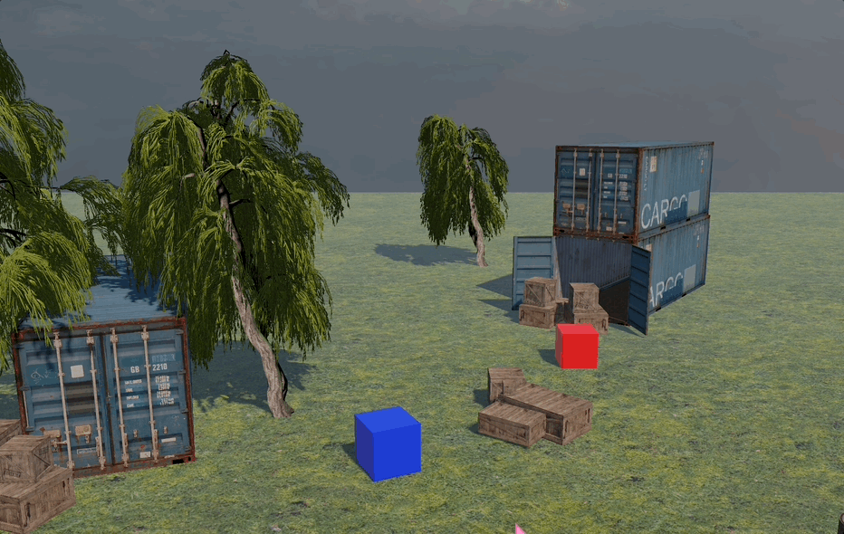
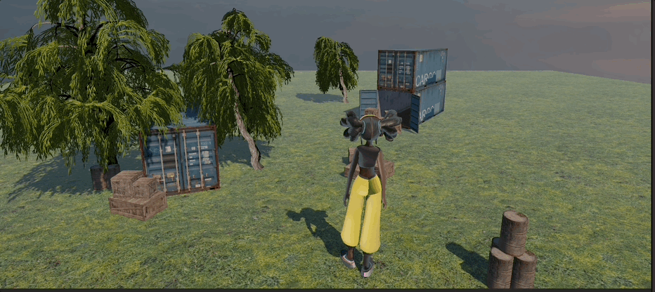

# M4_3D_GYM

## Input system & rigidbody

- Rode blokje beweegt met WASD
- Blauwe blokje beweegt met de arrow keys
- ze springen beide met space bar

## Mixamo character & animation

- Character van Mixamo erin gezet
- Character animations erin gezet

## Cinemachine & camera overview

- Cinemachine volgt de character
- Cinemachine beweegt als de muis ook beweegt
- Camera overview
- Camera wisselt door de Tab key in te drukken